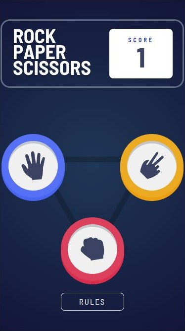
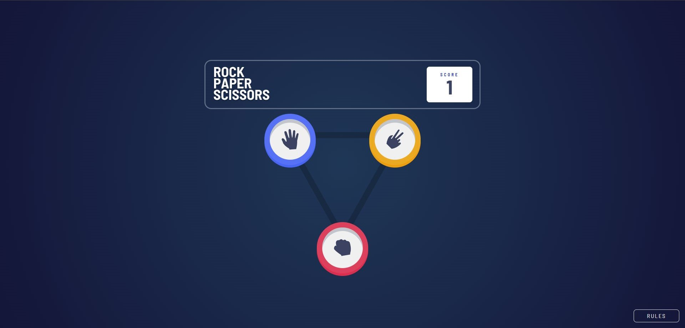
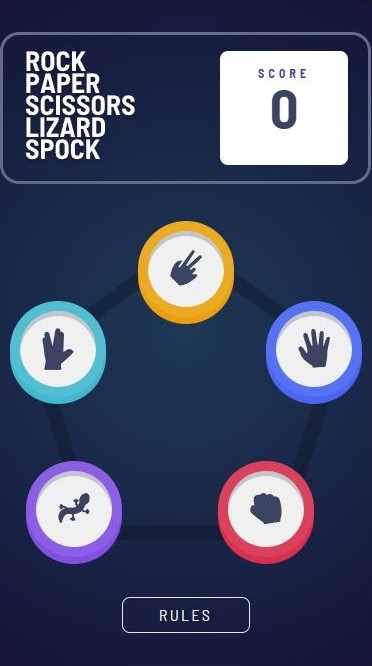
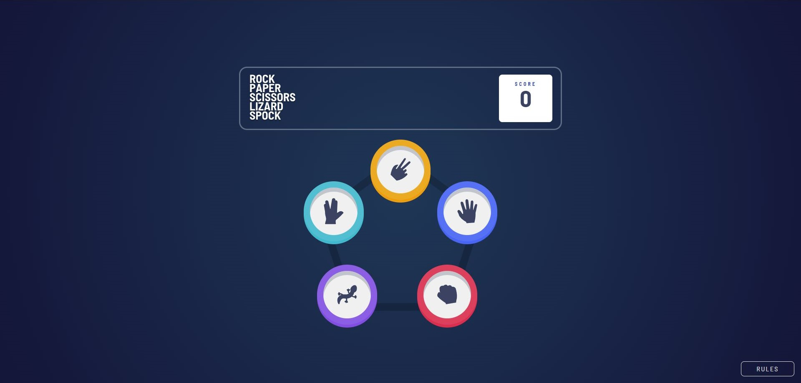
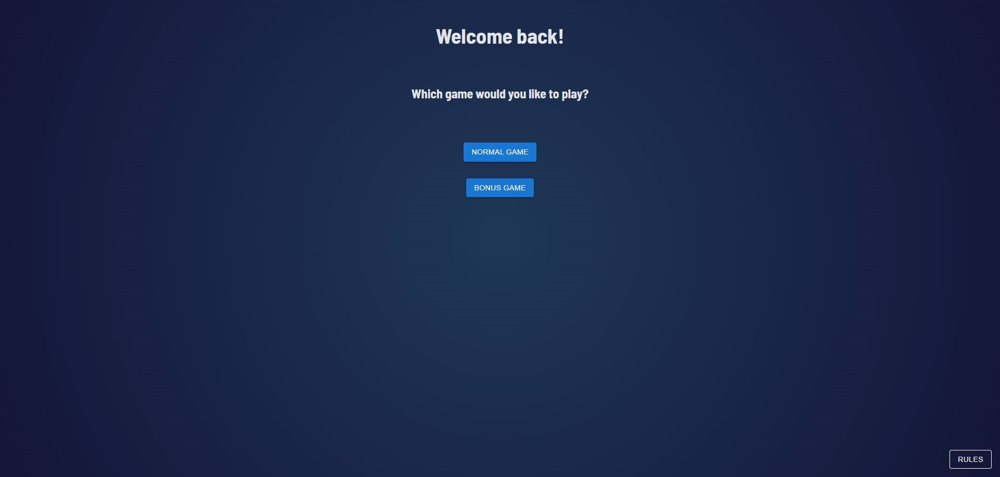
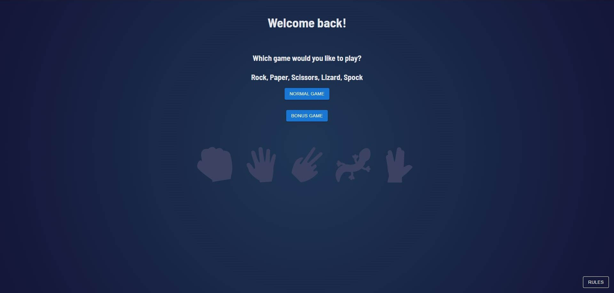

# Frontend Mentor - Rock, Paper, Scissors solution

This is a solution to the [Rock, Paper, Scissors challenge on Frontend Mentor](https://www.frontendmentor.io/challenges/rock-paper-scissors-game-pTgwgvgH). Frontend Mentor challenges help you improve your coding skills by building realistic projects. 

## Table of contents

- [Overview](#overview)
  - [The challenge](#the-challenge)
  - [Screenshot](#screenshot)
  - [Links](#links)
- [My process](#my-process)
  - [Built with](#built-with)
  - [What I learned](#what-i-learned)
  - [Continued development](#continued-development)
- [Author](#author)

**Note: Delete this note and update the table of contents based on what sections you keep.**

## Overview

### The challenge

Users should be able to:

- View the optimal layout for the game depending on their device's screen size
- Play Rock, Paper, Scissors against the computer
- Maintain the state of the score after refreshing the browser _(optional)_
- **Bonus**: Play Rock, Paper, Scissors, Lizard, Spock against the computer _(optional)_

### Screenshot








### Links

- Solution URL: [Add solution URL here](https://your-solution-url.com)
- Live Site URL: [Vercel](https://your-live-site-url.com)

## My process

### Built with

- Semantic HTML5 markup
- CSS custom properties
- Flexbox
- CSS Grid
- Mobile-first workflow
- [React](https://reactjs.org/) - JS library
- [TypeScript](https://www.typescriptlang.org/)
- [Styled Components](https://styled-components.com/) - For styles

### What I learned

Trying to improve my TypeScript skills. At first I used position absolute to move the containers for Rock Paper Scissors, but then I switched over to grid and positioning the container
inside the grid row and column. Also tried to create more reusable components with the Rules Modal.

```css
.gameArea {
    --size: 22em;
    display: grid;
    grid-template-columns: repeat(3, 1fr);
    grid-template-rows: repeat(2, 1fr);
    grid-template-areas: 
        "TopLeft TopCenter TopRight" 
        "MiddleLeft MiddleCenter MiddleRight" 
        "BottomLeft BottomCenter BottomRight";
    background-image: url("../assets/bg-triangle.svg");
    background-repeat: no-repeat;
    background-position: center;
    background-size: contain;
    height: var(--size);
    width: var(--size);
    position: relative;
    margin-inline: auto;
}
```
```js
function handleClicks(e: React.MouseEvent<HTMLButtonElement, MouseEvent>) {
  const id = e.currentTarget.id;
    if (id === 'again') {
      setSelected("");
      setWinner("");
      setComputerChoice("");
    } else {
      setSelected(() => id);
      const randomIndex = Math.floor(Math.random() * options.length);
      const computerChoice = options[randomIndex];
      setTimeout(() => {
        setComputerChoice(computerChoice);
      }, 500);

      if (['rock', 'paper', 'scissors', 'spock', 'lizard'].includes(id)) {
        const playerChoice = id as Choice;
        const computerChoose = computerChoice as Choice;
        setTimeout(() => {
            winnerFunction(playerChoice, computerChoose, setWinner, setScore);
        }, 500)
        }
    }
  }
```

### Continued development

Adding more user interaction could be beneficial. The landing page could use an update to store state in local storage and also adding a back button to the game to go back home

## Author

- Frontend Mentor - [@Okkie14](https://www.frontendmentor.io/profile/Okkie14)